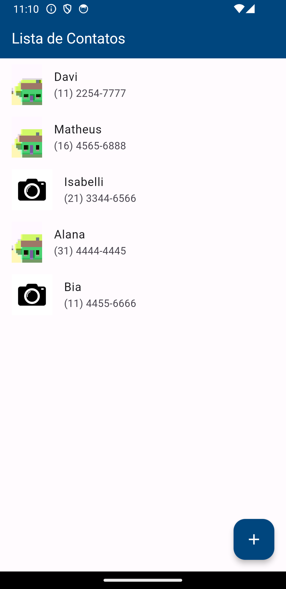
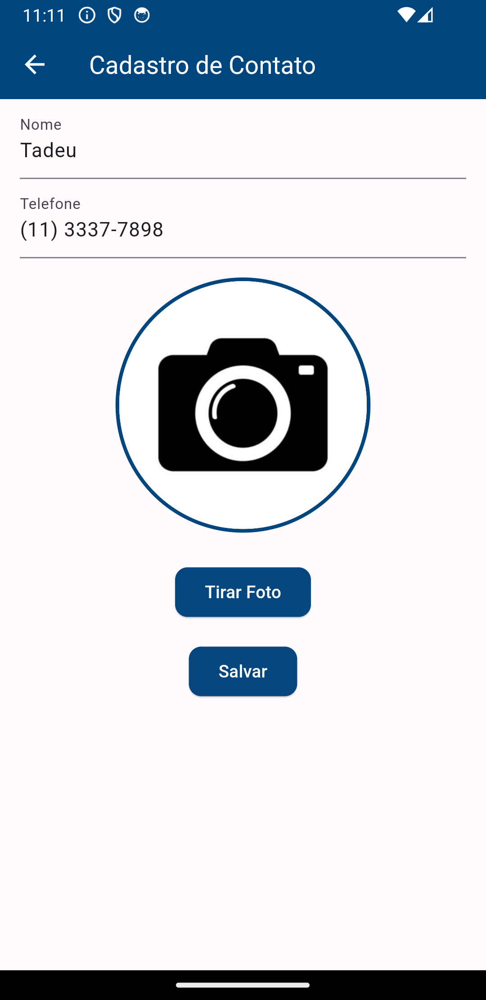
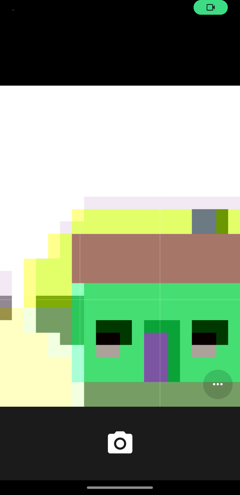
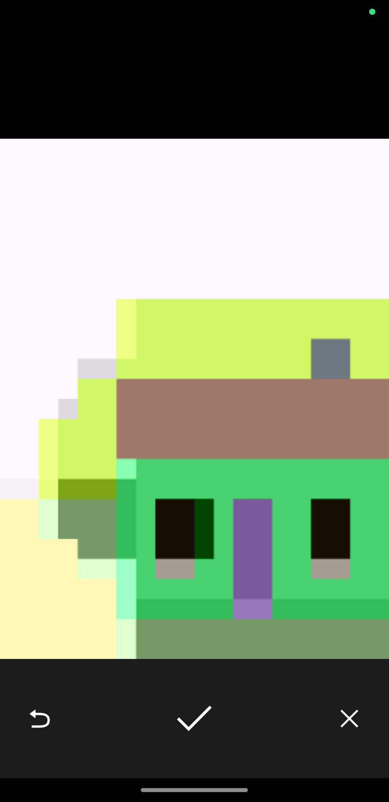
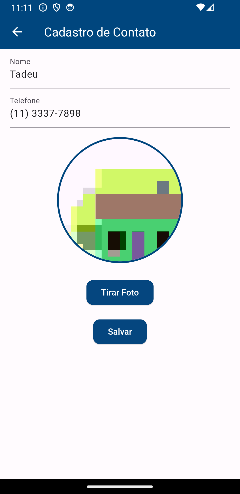
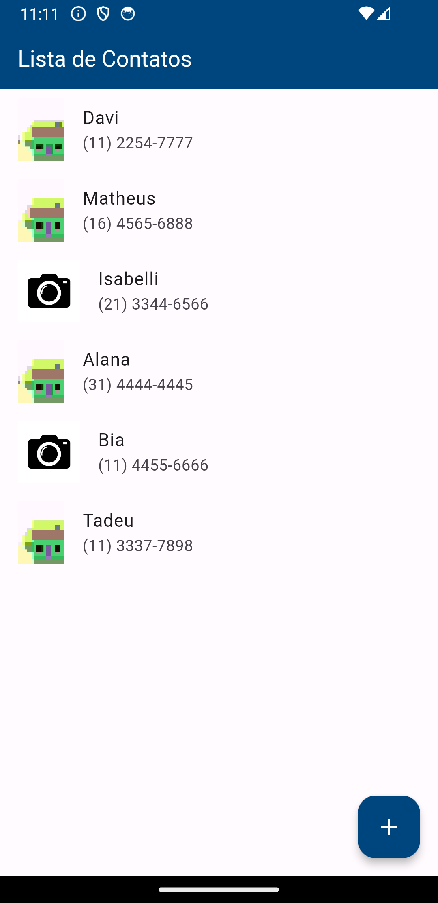
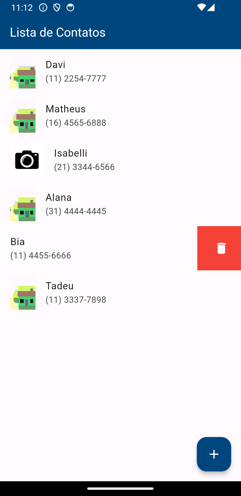

# Meus Contatos
Este é um aplicativo Flutter para gerenciar seus contatos. Com ele, você pode adicionar, editar e excluir contatos. Além disso, você pode adicionar uma foto a cada contato para torná-lo mais personalizado.

### Screenshots
 

  
   
   
   
   
   
   

### Recursos
- Lista de contatos: Veja todos os seus contatos em uma lista organizada.
- Cadastro de contatos: Adicione novos contatos à sua lista. Você pode adicionar as seguintes informações:
  - Nome
  - Número de telefone com mascara de DDD
  - Foto

### Como usar
1. Clone este repositório para a sua máquina local.
2. Navegue até a pasta do projeto no terminal.
3. Execute flutter `pub get` para instalar todas as dependências.
4. Execute `flutter run` para iniciar o aplicativo.

### Dependências
Este projeto usa as seguintes dependências:

- `flutter`: SDK do Flutter.
- `provider`: Gerenciamento de estado.
- `path`: Manipulação de caminhos de arquivos e diretórios.

### Estrutura do Projeto
O projeto segue a estrutura de diretórios padrão do Flutter. Aqui estão alguns dos diretórios importantes:

- `lib/`: Contém o código fonte do aplicativo.
  - `screens/`: Contém os arquivos de tela do aplicativo.
  - `providers/`: Contém os provedores de estado do aplicativo.
  - `repositories/`: Contém os repositórios de dados do aplicativo.
  - `use_cases/`: Contém os casos de uso do aplicativo.
- `assets/`: Contém os ativos do aplicativo, como imagens e ícones.

### Contribuindo
Contribuições são bem-vindas! Sinta-se à vontade para abrir uma issue ou enviar um pull request.